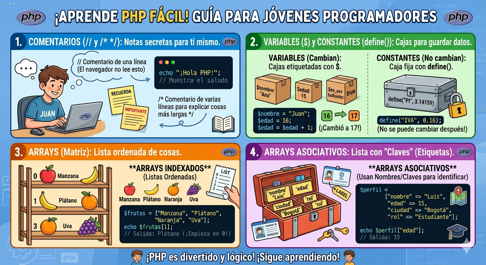

# introd_php
PHP es un lenguaje de programación de código abierto diseñado para el desarrollo web del lado del servidor, lo que significa que el código se procesa en el servidor antes de enviarse al navegador como HTML
. Como experto en programación, aquí tienes un contexto detallado sobre sus componentes fundamentales:
1. Comentarios
Los comentarios son notas que no se ejecutan y sirven para explicar o documentar el código, facilitando su mantenimiento
.
De una sola línea: Se pueden usar dos barras diagonales (//) o el símbolo de almohadilla (#)
.
Multilínea: Se encierran entre /* y */, ideal para explicaciones extensas o para anular bloques de código temporalmente
.
Contexto técnico: El símbolo # comenta hasta el final de la línea o hasta que se encuentre la etiqueta de cierre de PHP ?>
.
2. Variables
Son "contenedores" que almacenan información que puede cambiar durante la ejecución del programa
.
Reglas de sintaxis: Siempre deben comenzar con el signo de dólar ($), seguido de una letra o guion bajo, y nunca con un número
.
Tipado dinámico: PHP es un lenguaje de tipado débil, por lo que no es necesario declarar el tipo de dato (entero, cadena, etc.); el intérprete lo asigna automáticamente según el valor
.
Sensibilidad: Son sensibles a mayúsculas y minúsculas ($edad y $EDAD son distintas)
.
Asignación: Se pueden asignar por valor (por defecto) o por referencia usando el símbolo &
.
3. Constantes
A diferencia de las variables, las constantes almacenan valores fijos que no pueden modificarse ni eliminarse una vez definidos
.
Definición: Se crean mediante la función define() (en tiempo de ejecución) o la palabra clave const (en tiempo de compilación)
.
Sintaxis: No llevan el signo $ antes de su nombre y suelen escribirse en mayúsculas por convención
.
Ámbito: Son globales por naturaleza y pueden usarse en cualquier parte del script
.
4. Arrays (Arreglos)
Es una estructura de datos potente que permite guardar múltiples valores en una sola variable
. En PHP, los arrays son en realidad mapas ordenados
.
Arrays Indexados: Los elementos se organizan mediante posiciones numéricas llamadas índices, que comienzan automáticamente en 0
.
Arrays Multidimensionales: Son arrays que contienen otros arrays en su interior, útiles para agrupar registros complejos o datos anidados
.
5. Arrays Asociativos
Es un tipo especial de array donde, en lugar de números, se utilizan claves con nombre (etiquetas) para encontrar los valores
.
Funcionamiento: Utilizan el operador => para asociar una clave con su valor (ejemplo: "nombre" => "Ana")
.
Utilidad: Son ideales para representar datos estructurados como información de usuarios o detalles de productos sin necesidad de crear clases complejas
.
Acceso: Para obtener un dato, se solicita directamente por su nombre de clave, lo que hace el código mucho más legible
.
Funciones Esenciales para Arrays
Para trabajar como un experto, debes conocer estas herramientas integradas:
count(): Devuelve el número total de elementos
.
foreach: La forma más limpia y común de recorrer tanto arrays indexados como asociativos
.
in_array(): Comprueba si un valor específico existe dentro del array
.
array_key_exists(): Verifica si una clave específica ha sido definida en un array asociativo
.
sort() / asort() / ksort(): Diferentes funciones para ordenar por valor o por clave según el tipo de array

1. Operadores Aritméticos
Se utilizan para realizar operaciones matemáticas comunes. Según las fuentes, los principales son:
Suma (+), Resta (-), Multiplicación (*), División (/) y Módulo (%)
.
Exponenciación (**): Este operador fue introducido en PHP 5.6 para realizar potencias
.
2. Operadores de Asignación
Permiten otorgar un valor a una variable. El operador básico es el signo igual (=), pero existen formas abreviadas que combinan la asignación con otras operaciones:
Asignación básica (=): Asigna el valor de la derecha a la variable de la izquierda
.
Asignación por referencia (&): Permite que dos variables apunten al mismo contenido
.
Asignaciones combinadas: Como +=, -=, *=, /=, %= y .= (para concatenación), que realizan la operación y asignan el resultado en un solo paso
.
3. Operadores de Comparación
Se emplean para cotejar dos valores y devuelven un resultado booleano (verdadero o falso). Entre ellos se encuentran:
Igualdad (==) y Diferencia (!=)
.
Identidad (===): Devuelve verdadero solo si las expresiones son del mismo valor y del mismo tipo
.
Relacionales: Menor que (<), menor o igual que (<=), mayor que (>) y mayor o igual que (>=)
.
4. Operadores Lógicos
Sirven para combinar condiciones:
AND (and, &&): Verdadero si ambas expresiones son verdaderas
.
OR (or, ||): Verdadero si al menos una es verdadera
.
XOR (xor): Verdadero si solo una de las expresiones es verdadera, pero no ambas
.
NOT (!): Invierte el valor lógico de la expresión
.
Nota técnica: PHP diferencia entre and/or y &&/|| principalmente por su precedencia en la ejecución de las operaciones
.
5. Operadores de Incremento y Decremento
Son operadores unarios que aumentan o disminuyen el valor de una variable en una unidad:
Incremento (++): Aumenta el valor
.
Decremento (--): Disminuye el valor

